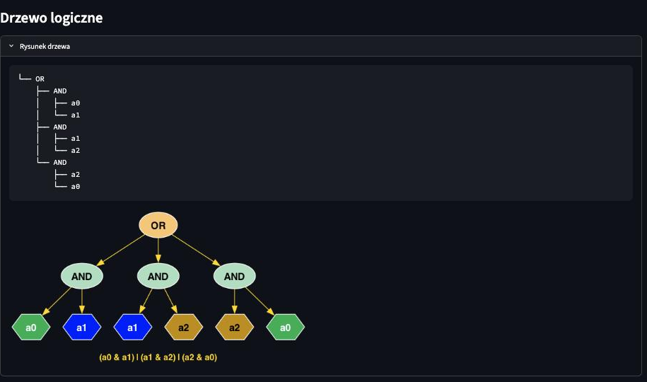
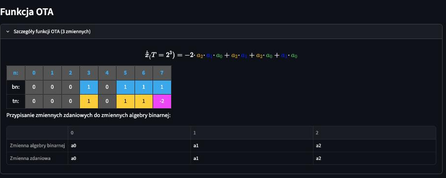
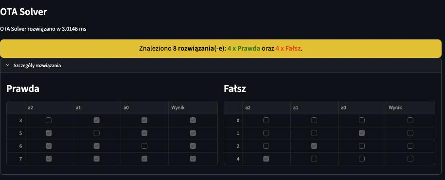
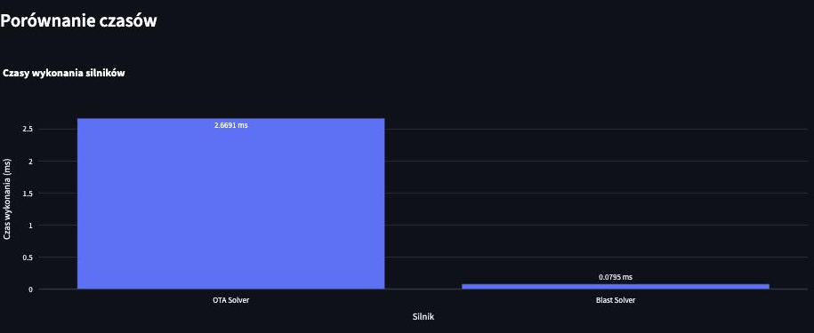

# BlastApp – Aplikacja rozwiązywania wyrażeń logicznych (Logika Binarna)

## Opis projektu

**BlastApp** to interaktywna aplikacja GUI (oparta na frameworku [Streamlit](https://streamlit.io/)) służąca do rozwiązywania i analizowania zdań logicznych przy użyciu koncepcji **Logiki Binarnej**. Zaimplementowano dwa silniki: algebraiczny **OTA Solver** i bitowy **BlastSolver**, umożliwiające ultraszybkie znajdowanie *wszystkich* rozwiązań zadanych formuł logicznych. Aplikacja pozwala na wizualizację drzew logicznych, obliczenie funkcji OTA oraz prezentację wyników – bez potrzeby konstruowania tradycyjnych tabel prawdy.

---

## Wprowadzenie – Logika Binarna

**Logika Binarna** łączy klasyczną algebrę boolowską (gdzie 1 = PRAWDA, 0 = FAŁSZ) z tzw. algebrą binarną, wykorzystującą funkcję OTA do opisu rozwiązań. Innowacją jest traktowanie 0 i 1 jako liczb całkowitych, a nie symboli.

### Zalety:

- **Brak tabel prawdy** – wszystkie kombinacje wyznacza się za pomocą funkcji OTA, jednorazowo.
- **Brak konieczności znajomości praw logiki** – operacje logiczne tłumaczy się na działania algebraiczne.
- **Szybkość** – złożone zdania (np. z 20 zmiennymi) rozwiązywane są w ułamku sekundy.

**Funkcja OTA** (One-hot Truth Assignment) zapisuje wynik dla wszystkich kombinacji n zmiennych jako ciąg $2^n$ współczynników $t_i$. Przykład dla 2 zmiennych:  
$\Phi = t_3\cdot a_1 a_0 + t_2\cdot a_1 + t_1\cdot a_0 + t_0$

---

## Instalacja i uruchomienie

Aplikację uruchomisz na **Windows**, **Linux** lub **macOS**.

### Wymagania:

- Python 3.13+
- [uv](https://docs.astral.sh/uv/) – menedżer pakietów i środowisk (zastępuje `pip` oraz `venv`)
- **Graphviz** – *zalecany*. Drzewo logiczne zawsze pokazuje się w postaci tekstowej, więc
  aplikacja działa i bez niego. Graphviz dokłada rysunek: w GUI obrazek PNG renderowany
  lokalnie, a w `solve.py` zapis drzewa do pliku. Bez niego GUI próbuje narysować drzewo
  po stronie przeglądarki, co bywa zawodne.

### Instalacja uv:

```bash
# macOS / Linux
curl -LsSf https://astral.sh/uv/install.sh | sh

# Windows (PowerShell)
powershell -ExecutionPolicy ByPass -c "irm https://astral.sh/uv/install.ps1 | iex"
```

Alternatywnie: `brew install uv` (macOS) lub `pipx install uv`.

### Instalacja Graphviza (zalecana):

```bash
# macOS
brew install graphviz

# Linux (Debian/Ubuntu)
sudo apt install graphviz
```

Na **Windows** pobierz instalator z [graphviz.org](https://graphviz.org/download/) i dodaj katalog
`bin` do zmiennej PATH.

Sprawdzenie, czy zadziałało:

```bash
    dot -V          # powinno wypisać wersję, np. "dot - graphviz version 15.1.1"
```

To pakiet systemowy, a nie zależność Pythona — `uv sync` go nie zainstaluje. Pythonowy pakiet
`graphviz` jest tylko nakładką na tę binarkę.

### Instalacja zależności:

1. W terminalu przejdź do katalogu z projektem.
2. Utwórz środowisko i zainstaluj zależności jednym poleceniem:
    ```bash
    uv sync
    ```
   `uv` sam pobierze właściwą wersję Pythona, utworzy `.venv` i zainstaluje dokładnie te wersje
   pakietów, które są zapisane w pliku `uv.lock`. Nie musisz ręcznie aktywować środowiska.

### Uruchomienie:

W folderze projektu wpisz:
```bash
    uv run streamlit run app.py
```
Po chwili w przeglądarce otworzy się strona aplikacji (domyślnie: http://localhost:8501).

Wyrażenie możesz też rozwiązać bezpośrednio z linii poleceń:
```bash
    uv run python solve.py "(a1 & ~a0) | a2"
    uv run python solve.py "(a1 & ~a0) | a2" --solver blast   # ota | blast | both
```

Porównanie wydajności z solverami PySAT i SymPy:
```bash
    uv run python -m blastapp.benchmarks.main
```
Wyniki trafiają do `benchmarks/results/results.csv`. Przebieg w pełnej konfiguracji jest długi -
zakres i liczbę powtórzeń zmienisz przez `BenchmarkSettings`.

### Składnia wyrażeń

| Operator | Zapis | Wiązanie |
| --- | --- | --- |
| negacja | `~` `⌐` `!` `NOT` | najmocniejsze |
| koniunkcja | `&` `∧` `/\` `AND` | |
| alternatywa wykluczająca | `^` `XOR` | |
| alternatywa | `\|` `∨` `\/` `OR` | |
| implikacja | `=>` `==>` `IMP` | |
| równoważność | `<=>` `EQ` | najslabsze |

Priorytety są zgodne z konwencją podręcznikową (`¬ > ∧ > XOR > ∨ > → > ↔`). Implikacja wiąże
prawostronnie: `p => q => r` znaczy `p => (q => r)`. To jedyny operator, dla ktorego kierunek
wiązania zmienia wynik — pozostałe są łączne.

Zmienne można nazywać dowolnie (`p`, `q`, `x1`). Nazwy postaci `aN` są traktowane szczególnie:
cyfra wyznacza pozycję bitu, więc `a5` zajmuje pozycję 5.

### Zarządzanie zależnościami:

```bash
    uv add <pakiet>        # dodaj nową zależność (aktualizuje pyproject.toml i uv.lock)
    uv remove <pakiet>     # usuń zależność
    uv lock --upgrade      # zaktualizuj zależności do najnowszych wersji
```

Zależności projektu opisane są w pliku `pyproject.toml`, a ich dokładne, zablokowane
wersje – w `uv.lock`. Oba pliki należy trzymać w repozytorium.

---

## Przykład działania

Załóżmy wyrażenie:
(a0 AND a1) OR (a1 AND a2) OR (a2 AND a0)

Dla 3 zmiennych aplikacja automatycznie:

- Wyświetli **drzewo logiczne**:

  

- Obliczy **funkcję OTA** oraz współczynniki dla wszystkich kombinacji:

  

- Pokaże **tabele wyników**:

  

- Porówna czasy działania solverów (OTA/Blast):

  

---

## Dla programistów

### Struktura

```
src/blastapp/
├── domain/          — parser wyrażeń, drzewo składniowe, algebry i reprezentacje.
│                      Nie zależy od pandas, Streamlita ani Graphviza.
├── presentation/    — CLI, GUI, renderowanie tekstu, LaTeX-a, HTML-a i wykresów
└── benchmarks/      — porównanie z zewnętrznymi solverami SAT
```

Kierunek zależności jest jednostronny: `presentation` i `benchmarks` znają `domain`, nigdy
odwrotnie. Pilnuje tego test `tests/test_layering.py`.

Dodanie trzeciego silnika sprowadza się do implementacji `PropositionAlgebra` i jednego wpisu
w `ENGINES` — CLI, panel boczny GUI i wykres czasów iterują po rejestrze.

### Testy i jakość

```bash
    uv run pytest                                    # ok. 8 s
    uv run ruff check . && uv run ruff format --check .
    uv run mypy
```

Testy sprawdzają oba silniki wobec **niezależnego wzorca**: `tests/reference_evaluator.py` liczy
formułę naiwnie, po wszystkich `2^n` wartościowaniach, nie korzystając z kodu solverów.

Projekt trzyma się zasad opisanych w `clean_code.md`.

## Autor

**Błażej Strus**  
  e-mail: b.strus@gmail.com  
  tel: +48 501 165 889

---

## Licencja

Brak określonej licencji. Jeśli chcesz użyć kodu – skontaktuj się z autorem.

---
